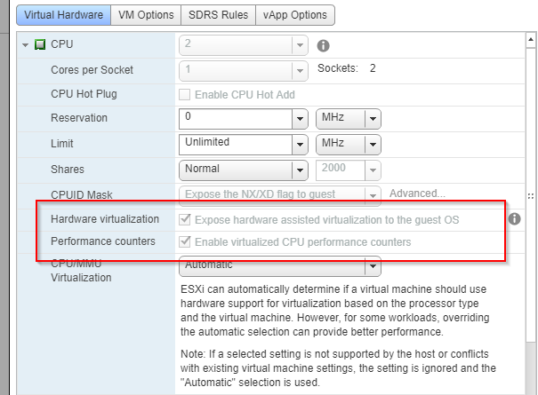

# What is this?
Creates a CentOS 8 image entirely from a Docker container using Packer and outputs disk as VMDK along with qcow format.

# Pre-Reqs

1. Need VM or machine with Docker installed
    - **NOTE:** Container will be run as `--privileged`
2. Requires roughly **20GB** of free space
3. If running on a VM *Hardware Virtualization* needs to be enabled


# To Run

```
git clone https://github.com/ryancbutler/docker-packer-kvm.git
cd docker-packer-kvm
sudo ./runme
```